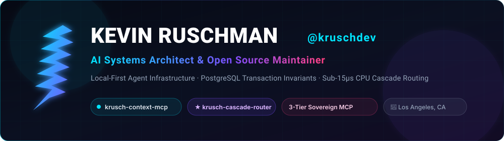
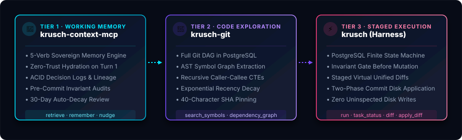

<div align="center">

  

  <br/><br/>

  [](https://krusch.dev)
  [](https://krusch.dev)
  [](https://github.com/kruschdev)
  [](https://github.com/kruschdev/krusch-context-mcp)
  [](https://www.linkedin.com/in/kevin-saylor-ruschman-1080493a3/)
  [](https://x.com/Kev96790724)

  <br/>

  ### Local-First Agent Infrastructure · PostgreSQL Transaction Invariants · Sub-15µs CPU Cascade Routing

</div>

---

### 💡 Engineering Premise

> **Language models are probabilistic samplers; modifying your codebase or managing confidential client knowledge requires a deterministic transaction manager.**

I build sovereign, local-first agent infrastructure so AI coding agents can plan, navigate, and verify multi-step tasks without mutating your physical disk until verified. State lives in PostgreSQL, models remain completely swappable, and operations enforce strict transactional invariants.

---

### 🛠️ The 3-Tier Sovereign Agent Ecosystem

Standardized across **Antigravity**, **Claude Code**, **Cursor**, and **Windsurf**:

<div align="center">
  
</div>

<br/>

| Tier | Subsystem | Authoritative Responsibility | Key Capabilities |
| :--- | :--- | :--- | :--- |
| **Tier 1** | [**`krusch-context-mcp`**](https://github.com/kruschdev/krusch-context-mcp) | **Working Memory & Invariants** | 5-verb sovereign memory engine (`retrieve`, `remember`, `revise`, `nudge`, `health`). Eliminates agent amnesia with ACID decision logs, lineage tracking, and pre-commit invariant gates. |
| **Tier 2** | [**`krusch-git`**](https://github.com/kruschdev/krusch-git) | **AST Code Graph & Exploration** | Full Git DAG in PostgreSQL, AST symbol extraction, caller-callee call graphs via recursive relational CTEs, 40-char SHA pinning, and exponential temporal recency decay. |
| **Tier 3** | [**`krusch` (Harness)**](https://github.com/kruschdev/krusch) | **Staged Execution & Verification** | PostgreSQL state machine, invariant gate before mutation, virtual unified diff staging, and two-phase commit (2PC) disk application. **Zero uninspected disk writes.** |
| **Bridge** | [**`@krusch/polygres-connector`**](https://github.com/kruschdev/krusch-polygres-connector) | **Zero-Friction Cloud Substrate** | Cloud connector marrying KruschContext with pgGraph and Wondersearch with 40-char SHA pinning, cross-substrate joins, and strict ABA Model Rule 1.6 air-gap protection. |

---

### 🚀 Flagship Systems & Open-Source Projects

#### ⚡ [krusch-cascade-router](https://github.com/kruschdev/krusch-cascade-router) · `Rank #1 on RouterArena`
Dual-stage microsecond cascade router designed for CPU-only execution. Evaluates semantic difficulty, token length, query structure, and sensitivity to route requests across free, cheap, and frontier models.
- **Latency**: Sub-15µs L1 heuristic gating; sub-8ms L2 dense vector centroid scoring.
- **Speculative Hedging**: Automatically dispatches hedge requests when fast models return ambiguous outputs.
- **Cost Reduction**: Slashes aggregate inference spend by 7–9% while beating baseline Sonnet 3.5 quality scores.

#### 🔌 [@krusch/polygres-connector](https://github.com/kruschdev/krusch-polygres-connector)
Cloud connector bridging local sovereign agent memory and codebase graphs with Polygres Cloud and Wondersearch.
- **Cross-Substrate Marriage**: `getSymbolContext()` resolves AST definitions, recursive caller CTEs, and active steering invariants in a single database round-trip.
- **Refactor Safety Gate**: Automatically flags `requiresCallerAudit = true` whenever a symbol with inbound callers is modified or renamed.
- **Air-Gap Boundary**: Enforces fail-closed isolation for privileged litigation matters and confidential commercial contracts.

#### ⚖️ [krusch-law](https://github.com/kruschdev/krusch-law)
100% air-gapped sovereign legal intelligence platform.
- **Zero Hallucination Grounding**: Enforces a 0.00% False Support Rate across statutory tenant protection codes and appellate cases.
- **Statutory Precedence DAG**: Traverses jurisdictional overrides and local ordinances with strict citation spine coordinates.
- **Air-Gap Compliance**: Runs strictly on local PostgreSQL 16 with realpath denial blocking cloud egress under ABA Model Rule 1.6.

#### 📑 [krusch-nexus](https://github.com/kruschdev/krusch-nexus)
Universal high-throughput document extraction and dual-provider RAG substrate.
- **Deterministic TOC Parser**: Extracts hierarchical document outlines in `<5ms`.
- **4-Stage Retrieval Ablation**: Vector-only, FTS-only, hybrid, and RRF + local cross-encoder reranking.

---

### 💻 Tech Stack & Sovereign Philosophy

```
  Languages        : TypeScript (ESM) · Python 3.12 · Rust · SQL · C/C++
  Databases        : PostgreSQL 16 · pgvector · SQLite (WAL) · DuckDB
  Agent Protocol   : Model Context Protocol (MCP) · JSON-RPC · SSE Streams
  Code Analysis    : Tree-Sitter AST · Relational Call Graphs (Recursive CTEs)
  Infrastructure   : Local Homelab Fleet · Linux (Ubuntu/Pop!_OS) · Docker
```

- **PostgreSQL-First Proxy**: Operational data, AST symbols, and agent episodic memories persist in relational PostgreSQL with strict relational foreign keys and indexes.
- **Fail-Closed Air-Gaps**: Cloud egress is opt-in (`ALLOW_CLOUD=1`). Private files, counterparty terms, and litigation matters remain strictly on-premises.
- **Deterministic Over Probabilistic**: Prompt chains are constrained by state machines, invariant verification gates, and atomic rollback journals.

---

### 📊 GitHub Activity & Metrics

<div align="center">
  
  
</div>

---

### 📖 Selected Articles & Deep Dives

- 📑 [**Zero-Friction Agent Substrates: Powering KruschContext & KruschGit with Swappable Local & Polygres Drives**](https://krusch.dev/articles/zero-friction-sovereignty-polygres.html) — *How AI coding agents eliminate amnesia with ACID decision logs and navigate code with relational AST graphs.*
- ⚡ [**RouterArena Global CI Evaluation: Sub-15µs Cascade Routing on Pure CPU**](https://krusch.dev) — *Benchmarking speculative hedging and dual-stage routing.*

---

<div align="center">
  <sub>Engineered by <strong>Kevin Ruschman (@kruschdev)</strong> · <a href="https://krusch.dev">krusch.dev</a></sub>
</div>
